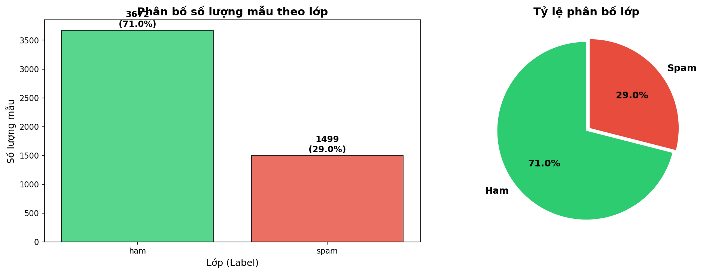
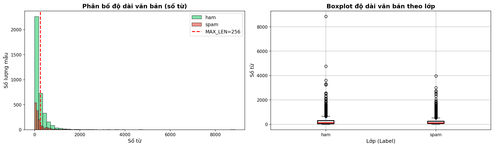
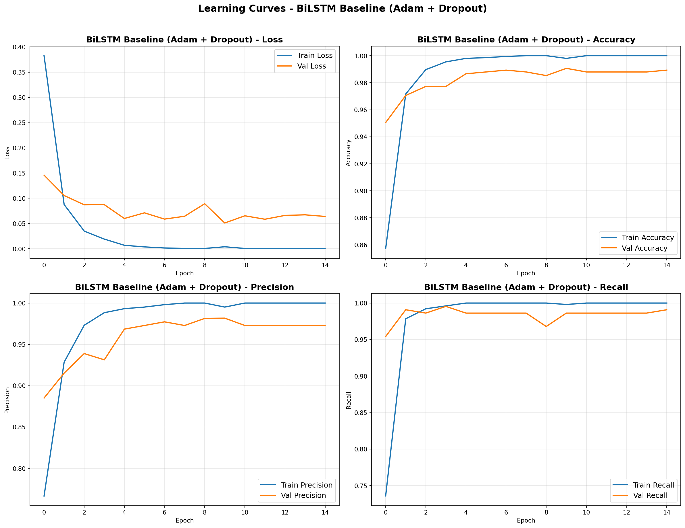
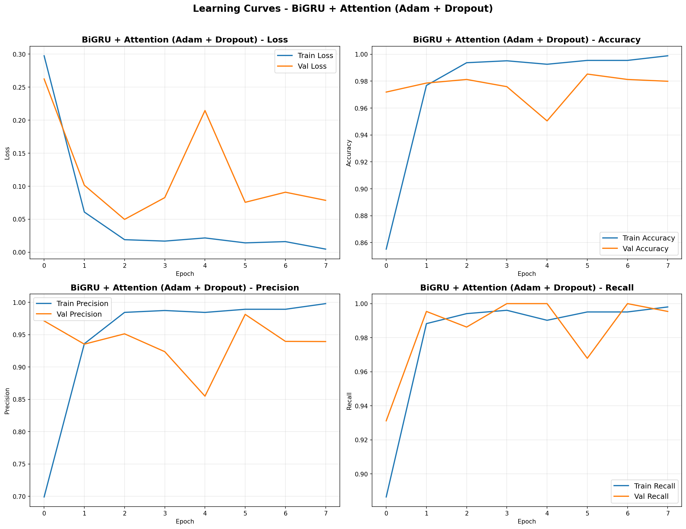
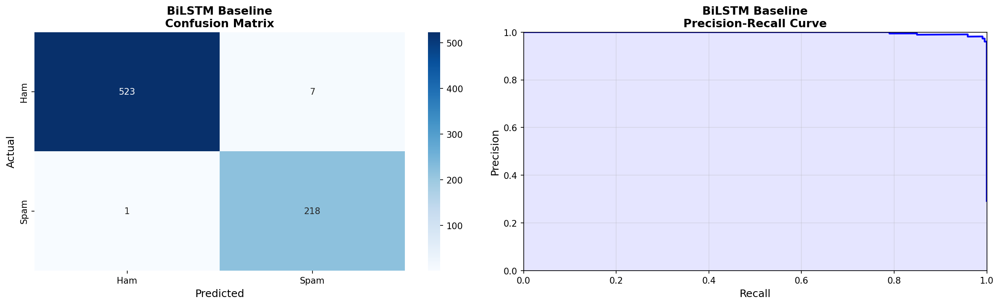
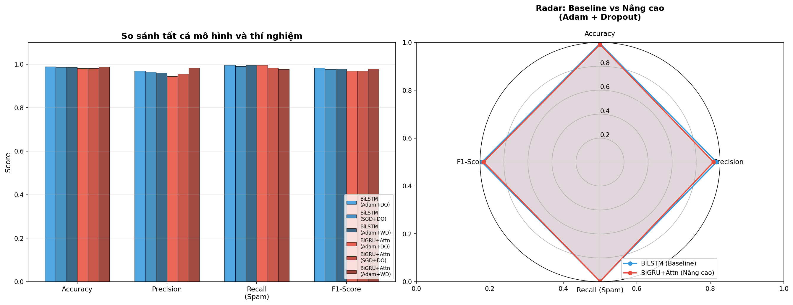
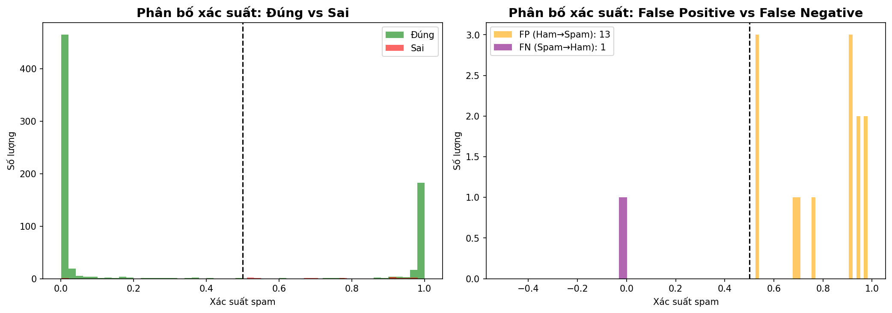

<div align="center">

# 📧 Deep Learning Spam Email Detection

### Phát hiện Spam Email sử dụng BiLSTM và BiGRU + Attention

[](https://www.python.org/)
[](https://www.tensorflow.org/)
[](https://keras.io/)
[](https://colab.research.google.com/)
[](LICENSE)

<p align="center">
  
  
  
  
  
</p>

<p align="center">
  <b>Đồ án môn Học sâu (Deep Learning) — Đề tài #20</b><br/>
  <i>Xây dựng hệ thống phát hiện spam email sử dụng mạng nơ-ron hồi quy sâu với cơ chế Attention</i>
</p>

[Tổng quan](#-tổng-quan) •
[Demo](#-demo) •
[Cài đặt](#-cài-đặt) •
[Sử dụng](#-sử-dụng) •
[Kiến trúc](#-kiến-trúc-mô-hình) •
[Kết quả](#-kết-quả) •
[Tài liệu](#-tài-liệu-tham-khảo)

</div>

---

## 📋 Tổng quan

Dự án này xây dựng hệ thống **phát hiện spam email tự động** sử dụng các mô hình Deep Learning. Hệ thống có khả năng phân loại email thành **Spam** (thư rác) hoặc **Ham** (thư hợp lệ) dựa trên nội dung văn bản.

### 🎯 Mục tiêu

- Phân tích bài toán phân loại nhị phân spam/ham và các thách thức đặc thù của dữ liệu email
- Triển khai và so sánh **2 mô hình Deep Learning**: BiLSTM (Baseline) và BiGRU + Attention (Nâng cao)
- Thực hiện **6 thí nghiệm** so sánh optimizer (Adam vs SGD) và regularization (Dropout vs Weight Decay)
- Xây dựng hệ thống demo phân loại email real-time

### ✨ Điểm nổi bật

- 🧠 **Custom Attention Layer** — Cho phép mô hình tập trung vào từ khóa quan trọng
- ⚖️ **Class Weight Balancing** — Xử lý hiệu quả dataset mất cân bằng (71% Ham / 29% Spam)
- 💾 **Save & Load Model** — Lưu model trên Google Drive, không cần train lại
- 🎮 **Interactive Demo** — Nhập email trực tiếp để phân loại spam/ham
- 📊 **Comprehensive Evaluation** — Precision, Recall, F1, Confusion Matrix, PR Curve

---

## 📁 Cấu trúc dự án

```
spam-email-detection/
│
├── 📓 notebook/
│   └── BaoCaoDoAnDeepLearning_V2.ipynb   # Notebook chính (chạy trên Colab)
│
├── 📊 data/
│   └── spam_ham_dataset.csv          # Dataset Enron Spam (5.5 MB)
│
├── 🧠 models/                        # Thư mục lưu model (tạo tự động)
│   ├── spam_model.keras              # Model tốt nhất (BiGRU+Attention)
│   ├── bilstm_baseline.keras         # BiLSTM + Adam + Dropout
│   ├── bilstm_sgd.keras              # BiLSTM + SGD + Dropout
│   ├── bilstm_weight_decay.keras     # BiLSTM + AdamW + Weight Decay
│   ├── bigru_attention.keras         # BiGRU+Attn + Adam + Dropout
│   ├── bigru_attention_sgd.keras     # BiGRU+Attn + SGD + Dropout
│   ├── bigru_attention_wd.keras      # BiGRU+Attn + AdamW + Weight Decay
│   └── tokenizer.pickle              # Tokenizer đã fit
│
├── 📈 results/                        # Kết quả thí nghiệm
│   ├── experiment_results.csv         # Bảng kết quả tổng hợp
│   ├── class_distribution.png         # Biểu đồ phân bố lớp
│   ├── text_length_distribution.png   # Biểu đồ độ dài text
│   ├── learning_curves_*.png          # Learning curves các model
│   ├── eval_*.png                     # Confusion matrix & PR curve
│   ├── final_comparison_all_models.png
│   └── error_analysis.png
│
├── 📄 report/
│   ├── main.tex                       # Báo cáo LaTeX
│   └── images/                        # Hình ảnh cho báo cáo
│
├── 📄 README.md
├── 📄 requirements.txt
└── 📄 LICENSE
```

---

## 🚀 Demo

### Phân loại email mẫu

```python
# Spam email
>>> predict_spam("Congratulations! You've won $1,000,000! Click here to claim now!")
🚨 SPAM | Xác suất: 0.9847 (98.47%)

# Ham email
>>> predict_spam("Hi team, reminder about our project meeting tomorrow at 10am.")
✅ HAM  | Xác suất: 0.0123 (1.23%)
```

### Interactive Demo

Sau khi chạy notebook, bạn có thể nhập bất kỳ nội dung email nào để phân loại:

```
📧 Nhập nội dung email: Buy cheap viagra online! Best prices!
═══════════════════════════════════════════════
📌 Kết quả  : 🚨 SPAM
📌 Xác suất spam: 0.9921 (99.21%)
📌 Độ tin cậy   : 0.9921 (99.21%)
═══════════════════════════════════════════════
```

---

## ⚙️ Cài đặt

### Yêu cầu hệ thống

| Thành phần | Yêu cầu |
|:-----------|:---------|
| Python | 3.8+ |
| TensorFlow | 2.x |
| RAM | ≥ 8 GB (khuyến nghị 12 GB+) |
| GPU | Khuyến nghị (NVIDIA T4/V100) |
| Disk | ≥ 500 MB |

### Cách 1: Google Colab (Khuyến nghị) ⭐

1. Mở notebook trên Google Colab:

   [](https://colab.research.google.com/github/NhatTien1114/spam-email-detector/blob/main/notebook/BaoCaoDoAnDeepLearning_V2.ipynb)

2. Chọn Runtime → Change runtime type → **GPU (T4)**

3. Chạy từng cell theo thứ tự

### Cách 2: Local Installation

```bash
# Clone repository
git clone https://github.com/NhatTien1114/spam-email-detector.git
cd spam-email-detector

# Tạo virtual environment
python -m venv venv
source venv/bin/activate        # Linux/macOS
# venv\Scripts\activate         # Windows

# Cài đặt dependencies
pip install -r requirements.txt
```

### Dependencies

```txt
tensorflow>=2.12.0
scikit-learn>=1.2.0
pandas>=1.5.0
numpy>=1.23.0
matplotlib>=3.6.0
seaborn>=0.12.0
```

---

## 📖 Sử dụng

### 1. Huấn luyện mô hình từ đầu

Mở notebook và chạy tuần tự các cell từ **Phần 0** đến **Phần 16**:

```python
# Phần 0: Mount Drive & Import
# Phần 1-2: Load data & EDA
# Phần 3-4: Tiền xử lý & Tokenization
# Phần 5-8: Mô hình 1 (BiLSTM Baseline)
# Phần 9-11: Thí nghiệm Optimizer & Regularization
# Phần 12-16: Mô hình 2 (BiGRU + Attention)
```

### 2. Load model đã train (không cần train lại)

```python
import pickle
from tensorflow import keras

# Định nghĩa AttentionLayer (bắt buộc khi load model)
class AttentionLayer(keras.layers.Layer):
    # ... (xem code trong notebook)

# Load model
model = keras.models.load_model(
    '/content/drive/MyDrive/dataset_dl/spam_model.keras',
    custom_objects={'AttentionLayer': AttentionLayer}
)

# Load tokenizer
with open('/content/drive/MyDrive/dataset_dl/tokenizer.pickle', 'rb') as f:
    tokenizer = pickle.load(f)

print("✅ Model loaded successfully!")
```

### 3. Dự đoán email mới

```python
def predict_spam(email_text, threshold=0.5):
    clean_text = preprocess_email(email_text)
    sequence = tokenizer.texts_to_sequences([clean_text])
    padded = pad_sequences(sequence, maxlen=256, padding='post', truncating='post')
    prob = model.predict(padded, verbose=0)[0][0]

    if prob >= threshold:
        print(f"🚨 SPAM | Xác suất: {prob:.4f} ({prob*100:.2f}%)")
    else:
        print(f"✅ HAM  | Xác suất: {prob:.4f} ({prob*100:.2f}%)")

# Ví dụ
predict_spam("URGENT: Your account will be suspended! Click here now!")
predict_spam("Hey, are you free for lunch today?")
```

---

## 🧠 Kiến trúc mô hình

### Mô hình 1 — BiLSTM Baseline

```
Input (256) → Embedding (20000×128) → SpatialDropout1D (0.2)
    → Bidirectional LSTM (128) → GlobalMaxPooling1D
    → Dense (64, ReLU) → Dropout (0.5) → Dense (32, ReLU)
    → Dense (1, Sigmoid) → Spam/Ham
```

```
┌───────────────────────────────���─────────────┐
│              Input (MAX_LEN=256)            │
├─────────────────────────────────────────────┤
│         Embedding (20000 × 128)             │
├─────────────────────────────────────────────┤
│          SpatialDropout1D (0.2)             │
├─────────────────────────────────────────────┤
│     Bidirectional LSTM (128 units)          │
│       ← ← ← LSTM ← ← ←                    │
│       → → → LSTM → → →                     │
├─────────────────────────────────────────────┤
│          GlobalMaxPooling1D                 │
├─────────────────────────────────────────────┤
│          Dense (64) + ReLU                  │
├─────────────────────────────────────────────┤
│            Dropout (0.5)                    │
├─────────────────────────────────────────────┤
│          Dense (32) + ReLU                  │
├─────────────────────────────────────────────┤
│       Dense (1) + Sigmoid → Output          │
└─────────────────────────────────────────────┘
```

### Mô hình 2 — BiGRU + Attention (Nâng cao)

```
Input (256) → Embedding (20000×128) → SpatialDropout1D (0.2)
    → BiGRU Layer 1 (128) → BiGRU Layer 2 (64)
    → [Attention Layer] + [GlobalMaxPooling1D]
    → Concatenate → Dense (128) + BatchNorm + Dropout (0.5)
    → Dense (64) + Dropout (0.3) → Dense (1, Sigmoid) → Spam/Ham
```

```
┌─────────────────────────────────────────────┐
│              Input (MAX_LEN=256)            │
├─────────────────────────────────────────────┤
│         Embedding (20000 × 128)             │
├─────────────────────────────────────────────┤
│          SpatialDropout1D (0.2)             │
├─────────────────────────────────────────────┤
│   Bidirectional GRU Layer 1 (128 units)     │
├─────────────────────────────────────────────┤
│   Bidirectional GRU Layer 2 (64 units)      │
├──────────────────┬──────────────────────────┤
│  Attention Layer │   GlobalMaxPooling1D     │
├──────────────────┴──────────────────────────┤
│              Concatenate                    │
├─────────────────────────────────────────────┤
│     Dense (128) + BatchNorm + Dropout       │
├─────────────────────────────────────────────┤
│       Dense (64) + Dropout (0.3)            │
├─────────────────────────────────────────────┤
│       Dense (1) + Sigmoid → Output          │
└─────────────────────────────────────────────┘
```

### Cải tiến của Mô hình 2 so với Baseline

| Cải tiến | Mô tả |
|:---------|:-------|
| **GRU thay LSTM** | Ít tham số hơn (2 gates vs 3 gates), huấn luyện nhanh hơn |
| **Stacked BiGRU (2 lớp)** | Trích xuất features ở mức trừu tượng cao hơn |
| **Attention Mechanism** | Tập trung vào từ khóa quan trọng cho phân loại |
| **Dual Pooling** | Kết hợp Attention + MaxPooling qua Concatenate |
| **BatchNormalization** | Ổn định và tăng tốc huấn luyện |

---

## 📊 Kết quả

### Dataset Overview

| Thuộc tính | Giá trị |
|:-----------|:--------|
| Tổng số mẫu | 5,170 emails |
| Lớp Ham (không spam) | 3,672 (71%) |
| Lớp Spam (thư rác) | 1,498 (29%) |
| Tỷ lệ Ham:Spam | ≈ 2.45:1 |
| Train / Val / Test | 70% / 15% / 15% |

### Bảng so sánh tổng hợp 6 thí nghiệm


| # | Mô hình | Optimizer | Regularization | Accuracy | Precision | Recall (Spam) | F1-Score |
|:-:|:--------|:----------|:---------------|:--------:|:---------:|:-------------:|:--------:|
| 1 | BiLSTM | Adam | Dropout=0.5 | *0.988* | *0.973* | * 0.986* | *0.980* |
| 2 | BiLSTM | SGD (m=0.9) | Dropout=0.5 | *0.984* | *0.968* | *0.977* | *0.973* |
| 3 | BiLSTM | AdamW | Weight Decay | *0.985* | *0.956* | *0.995* | *0.975* |
| 4 | **BiGRU+Attn** | **Adam** | **Dropout=0.5** | ***0.9813*** | ***0.9437*** | ***0.9954*** | ***0.9689*** |
| 5 | BiGRU+Attn | SGD (m=0.9) | Dropout=0.5 | *0.9813* | *0.9556* | *0.9817* | *0.9685* |
| 6 | BiGRU+Attn | AdamW | Weight Decay | *0.9880* | *0.9817* | *0.9772* | *0.9794* |

> 📌 *Cập nhật kết quả sau khi chạy notebook. Dòng in đậm là mô hình tốt nhất.*

### Kết quả trực quan

<details>
<summary>📊 Phân bố dữ liệu (Click để xem)</summary>




</details>

<details>
<summary>📈 Learning Curves (Click để xem)</summary>




</details>

<details>
<summary>🎯 Evaluation — Confusion Matrix & PR Curve (Click để xem)</summary>




</details>

<details>
<summary>🏆 So sánh tổng hợp (Click để xem)</summary>



</details>

<details>
<summary>🔍 Phân tích lỗi (Click để xem)</summary>



</details>

---

## 🔧 Hyperparameters

| Parameter | Value |
|:----------|:------|
| `MAX_WORDS` | 20,000 |
| `MAX_LEN` | 256 |
| `EMBEDDING_DIM` | 128 |
| `BATCH_SIZE` | 32 |
| `EPOCHS` (max) | 30 |
| `LEARNING_RATE` (Adam) | 1e-3 |
| `LEARNING_RATE` (SGD) | 1e-2 |
| `MOMENTUM` (SGD) | 0.9 |
| `DROPOUT` | 0.5 |
| `WEIGHT_DECAY` | 1e-4 |
| `EARLY_STOPPING_PATIENCE` | 5 |
| `LR_REDUCE_PATIENCE` | 3 |
| `LR_REDUCE_FACTOR` | 0.5 |
| `RANDOM_SEED` | 42 |

---

## 📐 Pipeline xử lý

```
┌──────────────┐     ┌──────────────┐     ┌──────────────┐     ┌──────────────┐
│  Raw Email   │────▶│ Text Cleaning│────▶│ Tokenization │────▶│   Padding    │
│  (HTML, URL) │     │ (Lowercase,  │     │ (Keras, 20K  │     │ (MAX_LEN=    │
│              │     │  Regex)      │     │  vocab)      │     │  256)        │
└──────────────┘     └──────────────┘     └──────────────┘     └──────┬───────┘
                                                                      │
                                                                      ▼
┌──────────────┐     ┌──────────────┐     ┌──────────────┐     ┌──────────────┐
│   Output     │◀────│  Sigmoid     │◀────│ Dense Layers │◀────│ BiLSTM/BiGRU │
│  Spam/Ham    │     │  Threshold   │     │ + Dropout    │     │ + Attention  │
└──────────────┘     └──────────────┘     └──────────────┘     └──────────────┘
```

### Tiền xử lý dữ liệu

```python
def preprocess_email(text):
    text = re.sub(r'^Subject:\s*', '', text)     # Loại bỏ prefix Subject
    text = re.sub(r'<[^>]+>', ' ', text)          # Loại bỏ HTML tags
    text = re.sub(r'http[s]?://\S+', ' ', text)  # Loại bỏ URLs
    text = re.sub(r'\S+@\S+', ' ', text)          # Loại bỏ email addresses
    text = text.lower()                            # Lowercase
    text = re.sub(r'[^a-z0-9\s]', ' ', text)     # Loại bỏ ký tự đặc biệt
    return text.strip()
```

---

## 📂 Files trên Google Drive

Sau khi chạy notebook, các files được lưu tại `/content/drive/MyDrive/dataset_dl/`:

| File | Mô tả | Kích thước |
|:-----|:-------|:-----------|
| `spam_model.keras` | Model tốt nhất (BiGRU+Attention) | ~15 MB |
| `tokenizer.pickle` | Tokenizer đã fit | ~2 MB |
| `bilstm_baseline.keras` | BiLSTM + Adam + Dropout | ~12 MB |
| `bigru_attention.keras` | BiGRU+Attn + Adam + Dropout | ~15 MB |
| `experiment_results.csv` | Bảng kết quả tổng hợp | ~1 KB |
| `*.png` | Biểu đồ và hình ảnh kết quả | ~100 KB/file |

---

## 🧪 Thí nghiệm thực hiện

### So sánh Optimizer

| Optimizer | Đặc điểm | Ưu điểm | Nhược điểm |
|:----------|:---------|:---------|:-----------|
| **Adam** (lr=1e-3) | Adaptive learning rate | Hội tụ nhanh, ổn định | Có thể generalize kém hơn SGD |
| **SGD** (lr=1e-2, m=0.9) | Fixed learning rate + momentum | Generalization tốt | Hội tụ chậm, nhạy cảm với lr |

### So sánh Regularization

| Kỹ thuật | Cơ chế | Ưu điểm | Nhược điểm |
|:---------|:-------|:---------|:-----------|
| **Dropout** (p=0.5) | Ngẫu nhiên tắt neurons | Hiệu quả với data ít | Tăng variance khi inference |
| **Weight Decay** (λ=1e-4) | L2 penalty trên weights | Giới hạn complexity | Kém hiệu quả với dataset nhỏ |

---

## 🤝 Đóng góp

Contributions, issues và feature requests đều được hoan nghênh!

```bash
# Fork repo
# Tạo branch mới
git checkout -b feature/amazing-feature

# Commit changes
git commit -m 'Add amazing feature'

# Push to branch
git push origin feature/amazing-feature

# Mở Pull Request
```

---

## 👥 Tác giả

<table>
  <tr>
    <td align="center">
      <a href="https://github.com/NhatTien1114">
        
        <br />
        <sub><b>Tống Nguyễn Nhật Tiến</b></sub>
      </a>
    </td>
    <td align="center">
      <a href="https://github.com/NguyenTiePhat">
        <br />
        <sub><b>Nguyễn Tiến Phát</b></sub>
      </a>
    </td>
  </tr>
</table>

**Đồ án môn:** Học sâu (Deep Learning)
**Đề tài:** #20 — Phát hiện Spam Email
**Năm học:** 2025 – 2026

---

## 📚 Tài liệu tham khảo

1. I. Goodfellow, Y. Bengio, and A. Courville, *Deep Learning*, MIT Press, 2016.
2. S. Hochreiter and J. Schmidhuber, "Long Short-Term Memory," *Neural Computation*, vol. 9, no. 8, pp. 1735–1780, 1997.
3. K. Cho et al., "Learning Phrase Representations using RNN Encoder-Decoder for Statistical Machine Translation," *EMNLP*, 2014.
4. D. Bahdanau, K. Cho, and Y. Bengio, "Neural Machine Translation by Jointly Learning to Align and Translate," *ICLR*, 2015.
5. D. P. Kingma and J. Ba, "Adam: A Method for Stochastic Optimization," *ICLR*, 2015.
6. N. Srivastava et al., "Dropout: A Simple Way to Prevent Neural Networks from Overfitting," *JMLR*, vol. 15, 2014.
7. Y. Kim, "Convolutional Neural Networks for Sentence Classification," *EMNLP*, 2014.

---

## 📄 License

Distributed under the MIT License. See [`LICENSE`](LICENSE) for more information.

---

<div align="center">

**⭐ Nếu dự án hữu ích, hãy cho một star nhé! ⭐**

Made with ❤️ by [NhatTien1114](https://github.com/NhatTien1114)

</div>
