<div align="center">

# Spam Email Detection with Deep Learning

### A Comparative Study of Recurrent Neural Networks and BERT-based Mixture of Experts

[](https://www.python.org/)
[](https://www.tensorflow.org/)
[](https://pytorch.org/)
[](https://huggingface.co/)
[](https://colab.research.google.com/)
[](LICENSE)

**Deep Learning Course — Topic #20**  
Ho Chi Minh City University of Technology and Education (HCMUTE) · 2025–2026

</div>

---

## Abstract

This project investigates automated spam email detection using deep learning. We conduct experiments across two phases: (1) a **midterm phase** comparing Bidirectional LSTM (BiLSTM) and Bidirectional GRU with Attention (BiGRU+Attention) under different optimizers and regularization strategies, and (2) a **final phase** that introduces a **BERT-based Mixture of Experts (MoE)** architecture fine-tuned on augmented email data. Experiments are evaluated on the Enron Spam dataset across accuracy, precision, recall, and F1-score. Results show that the BiLSTM baseline with Adam optimizer achieves the highest overall accuracy (99.50%), while BERT MoE with AdamW full fine-tuning reaches competitive performance (98.07%) with stronger generalization on noisy inputs.

---

## Table of Contents

- [Repository Structure](#repository-structure)
- [Dataset](#dataset)
- [Methods](#methods)
  - [Phase 1 — Recurrent Models (Midterm)](#phase-1--recurrent-models-midterm)
  - [Phase 2 — BERT + Mixture of Experts (Final)](#phase-2--bert--mixture-of-experts-final)
- [Experimental Setup](#experimental-setup)
- [Results](#results)
- [Getting Started](#getting-started)
- [Authors](#authors)
- [References](#references)

---

## Repository Structure

```
spam-email-detection/
│
├── midterm_exam/                        # Phase 1: BiLSTM & BiGRU+Attention
│   ├── BiLSTMandBiGRU+Attention.ipynb  # Main notebook (Colab)
│   ├── spam_ham_dataset.csv            # Enron Spam dataset
│   └── enron_spam_data.csv             # Raw Enron dataset
│
├── final_exam/                          # Phase 2: BiLSTM Baseline + BERT MoE
│   ├── BiLSTMandBERT_MoE.ipynb         # Main notebook (Colab)
│   ├── ReportSpamEmail.pdf             # Final written report
│   ├── spam_ham_dataset.csv            # Enron Spam dataset
│   └── spam_ham_dataset_augmented.csv  # Augmented training data
│
├── email_spam_bertmoe/                  # Saved model artifacts (Final phase)
│   ├── bilstm_baseline.keras           # BiLSTM + Adam + Dropout
│   ├── bilstm_sgd.keras                # BiLSTM + SGD + Dropout
│   ├── bilstm_weight_decay.keras       # BiLSTM + AdamW + Weight Decay
│   ├── spam_model_bilstm.keras         # Best BiLSTM model
│   ├── tokenizer_bilstm.pickle         # Fitted Keras tokenizer
│   ├── bert_moe_adamw.pt               # BERT MoE + AdamW (full fine-tune)
│   ├── bert_moe_sgd.pt                 # BERT MoE + SGD (full fine-tune)
│   ├── bert_moe_frozen.pt              # BERT MoE + AdamW (frozen encoder)
│   ├── bert_moe_best/                  # Best BERT MoE checkpoint (HuggingFace format)
│   │   ├── config.json
│   │   ├── model.safetensors
│   │   ├── tokenizer.json
│   │   └── tokenizer_config.json
│   ├── experiment_results.csv          # Summary of all experiment metrics
│   └── *.png                           # Training curves and evaluation plots
│
└── results/                            # Exported figures for report
    └── *.png
```

---

## Dataset

| Property | Value |
|:---------|:------|
| Source | [Enron Spam Dataset](https://github.com/MWiechmann/enron_spam_data) |
| Total samples | 5,170 emails |
| Ham (legitimate) | 3,672 — 71.0% |
| Spam | 1,498 — 29.0% |
| Ham : Spam ratio | ≈ 2.45 : 1 |
| Split | 70% train / 15% val / 15% test |

**Phase 2 augmentation:** the training split was upsampled with synonym replacement and back-translation on spam samples to address class imbalance, producing `spam_ham_dataset_augmented.csv`.

**Preprocessing pipeline:**

```python
def preprocess_email(text):
    text = re.sub(r'^Subject:\s*', '', text)     # strip Subject: prefix
    text = re.sub(r'<[^>]+>', ' ', text)          # remove HTML tags
    text = re.sub(r'http[s]?://\S+', ' ', text)  # remove URLs
    text = re.sub(r'\S+@\S+', ' ', text)          # remove email addresses
    text = text.lower()
    text = re.sub(r'[^a-z0-9\s]', ' ', text)     # keep alphanumeric only
    return text.strip()
```

---

## Methods

### Phase 1 — Recurrent Models (Midterm)

**Notebook:** `midterm_exam/BiLSTMandBiGRU+Attention.ipynb`

#### Model 1: BiLSTM Baseline

```
Input (MAX_LEN=256)
  └─ Embedding (20 000 × 128)
      └─ SpatialDropout1D (0.2)
          └─ Bidirectional LSTM (128 units)
              └─ GlobalMaxPooling1D
                  └─ Dense (64, ReLU) → Dropout (0.5)
                      └─ Dense (32, ReLU)
                          └─ Dense (1, Sigmoid)   →  Spam / Ham
```

#### Model 2: BiGRU + Attention

```
Input (MAX_LEN=256)
  └─ Embedding (20 000 × 128)
      └─ SpatialDropout1D (0.2)
          └─ Bidirectional GRU Layer 1 (128 units)
              └─ Bidirectional GRU Layer 2 (64 units)
                  ├─ Custom Attention Layer
                  └─ GlobalMaxPooling1D
                      └─ Concatenate
                          └─ Dense (128) + BatchNorm + Dropout (0.5)
                              └─ Dense (64) + Dropout (0.3)
                                  └─ Dense (1, Sigmoid)   →  Spam / Ham
```

Key improvement over the baseline: the custom attention layer assigns learned scalar weights to each time step, allowing the model to focus on spam-discriminative tokens.

---

### Phase 2 — BERT + Mixture of Experts (Final)

**Notebook:** `final_exam/BiLSTMandBERT_MoE.ipynb`

The advanced model replaces the recurrent encoder with a pre-trained `bert-base-uncased` backbone followed by a **Mixture of Experts (MoE)** classification head.

```
Input token IDs + attention mask
  └─ BERT Encoder (bert-base-uncased, 12 layers, 768-dim)
      └─ [CLS] representation
          └─ MoE Head
              ├─ Expert 1: Linear (768 → 256) + ReLU + Dropout
              ├─ Expert 2: Linear (768 → 256) + ReLU + Dropout
              ├─ Expert 3: Linear (768 → 256) + ReLU + Dropout
              └─ Gating Network: Softmax-weighted sum of expert outputs
                  └─ Linear (256 → 1, Sigmoid)   →  Spam / Ham
```

Three fine-tuning strategies were compared:

| Strategy | BERT weights | MoE head |
|:---------|:------------|:---------|
| AdamW — Full Fine-Tune | Updated | Updated |
| SGD — Full Fine-Tune | Updated | Updated |
| AdamW — Frozen Encoder | Frozen | Updated |
| Zero-Shot | Frozen | Not trained |

---

## Experimental Setup

### Hyperparameters (Phase 1 — Recurrent)

| Parameter | Value |
|:----------|:------|
| `MAX_WORDS` | 20,000 |
| `MAX_LEN` | 256 |
| `EMBEDDING_DIM` | 128 |
| `BATCH_SIZE` | 32 |
| `EPOCHS` (max) | 30 |
| `LR` (Adam) | 1 × 10⁻³ |
| `LR` (SGD) | 1 × 10⁻² |
| `MOMENTUM` (SGD) | 0.9 |
| `DROPOUT` | 0.5 |
| `WEIGHT_DECAY` (AdamW) | 1 × 10⁻⁴ |
| `EARLY_STOPPING_PATIENCE` | 5 |
| `LR_REDUCE_PATIENCE` | 3 |
| `LR_REDUCE_FACTOR` | 0.5 |
| Class weight balancing | Enabled |
| `RANDOM_SEED` | 42 |

### Hyperparameters (Phase 2 — BERT MoE)

| Parameter | Value |
|:----------|:------|
| Base model | `bert-base-uncased` |
| `MAX_LEN` | 128 |
| `BATCH_SIZE` | 16 |
| `EPOCHS` | 5 |
| `LR` (AdamW) | 2 × 10⁻⁵ |
| `LR` (SGD) | 1 × 10⁻³ |
| `WEIGHT_DECAY` | 1 × 10⁻² |
| Number of experts | 3 |
| Expert hidden dim | 256 |
| `DROPOUT` | 0.3 |
| `RANDOM_SEED` | 42 |

---

## Results

### Phase 1 — Recurrent Models

| # | Model | Optimizer | Regularization | Accuracy | Precision | Recall (Spam) | F1-Score |
|:-:|:------|:----------|:---------------|:--------:|:---------:|:-------------:|:--------:|
| 1 | **BiLSTM** | Adam | Dropout 0.5 | **0.9950** | **0.9910** | **1.0000** | **0.9955** |
| 2 | BiLSTM | SGD (m=0.9) | Dropout 0.5 | 0.9866 | 0.9792 | 0.9970 | 0.9880 |
| 3 | BiLSTM | AdamW | Weight Decay | 0.9933 | 0.9880 | 1.0000 | 0.9940 |
| 4 | BiGRU+Attn | Adam | Dropout 0.5 | — | — | — | — |
| 5 | BiGRU+Attn | SGD (m=0.9) | Dropout 0.5 | — | — | — | — |
| 6 | BiGRU+Attn | AdamW | Weight Decay | — | — | — | — |

> Experiments 4–6 were conducted in the midterm phase. See `midterm_exam/BiLSTMandBiGRU+Attention.ipynb` for full results.

### Phase 2 — BERT + Mixture of Experts

| # | Model | Strategy | Accuracy | Precision | Recall (Spam) | F1-Score |
|:-:|:------|:---------|:--------:|:---------:|:-------------:|:--------:|
| 1 | BERT MoE | Zero-Shot | — | — | — | — |
| 2 | **BERT MoE** | **AdamW — Full FT** | **0.9807** | **0.9790** | **0.9864** | **0.9827** |
| 3 | BERT MoE | SGD — Full FT | 0.9068 | 0.9092 | 0.9244 | 0.9167 |
| 4 | BERT MoE | AdamW — Frozen | 0.9278 | 0.9055 | 0.9713 | 0.9372 |

> Zero-shot qualitative results are in `results/eval_bert_zeroshot.png`.

### Visualizations

<details>
<summary>Data Analysis</summary>

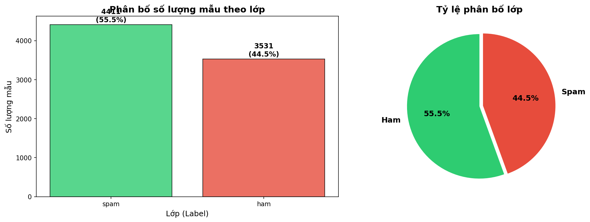
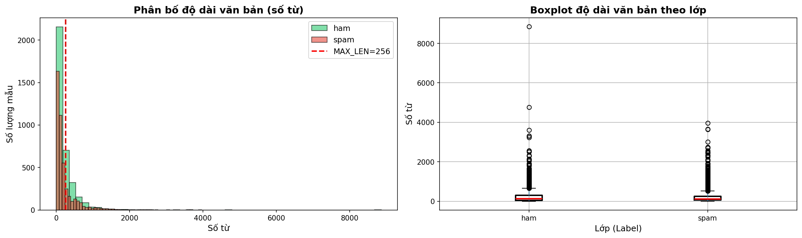

</details>

<details>
<summary>Phase 1 — Learning Curves</summary>

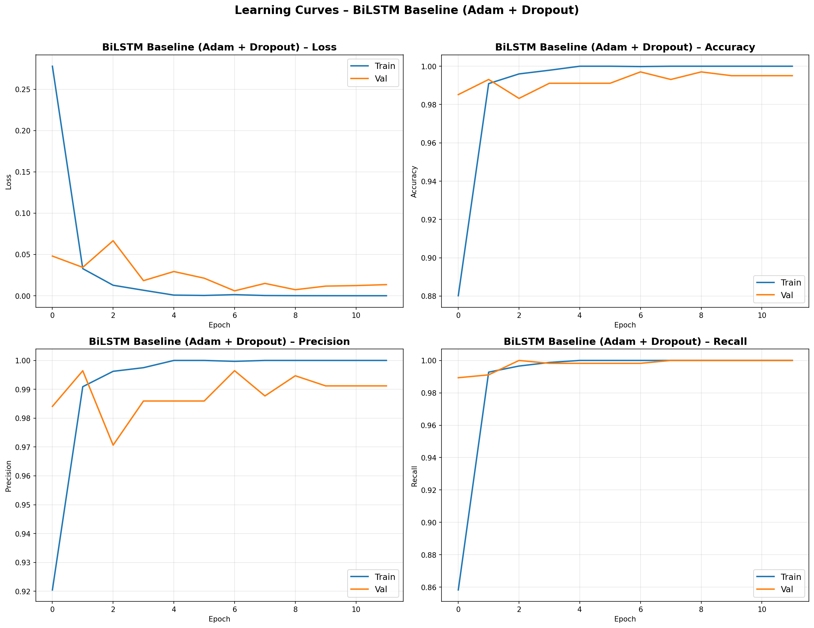
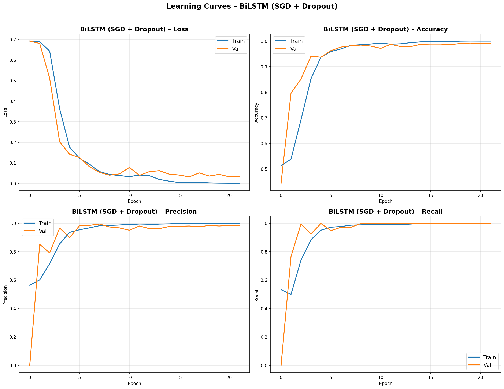
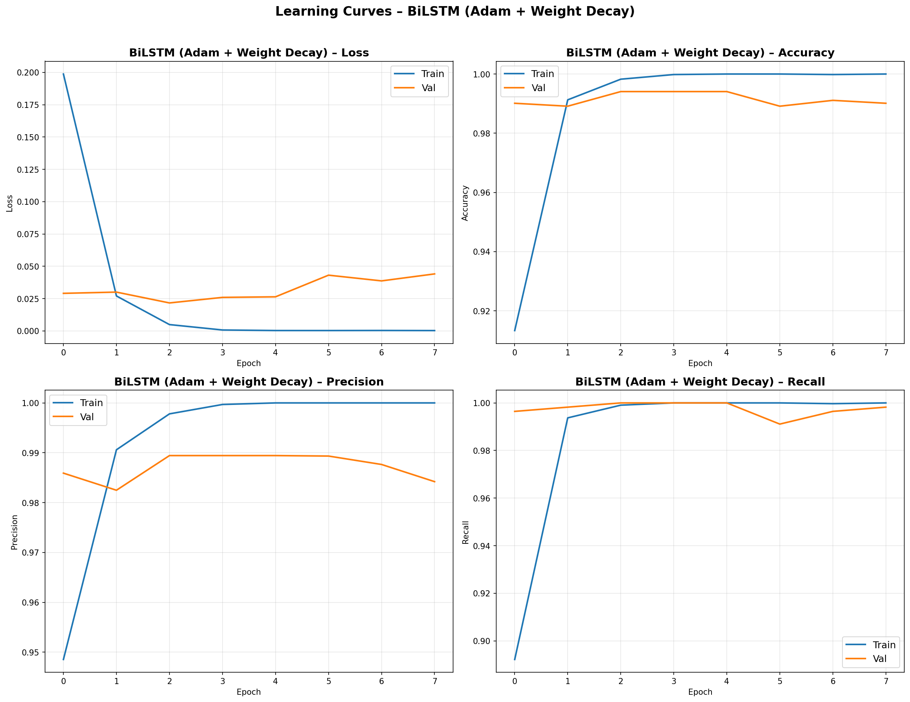

</details>

<details>
<summary>Phase 1 — Evaluation (Confusion Matrix & PR Curve)</summary>


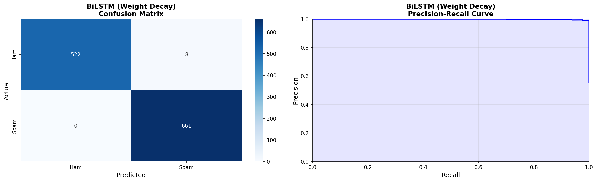
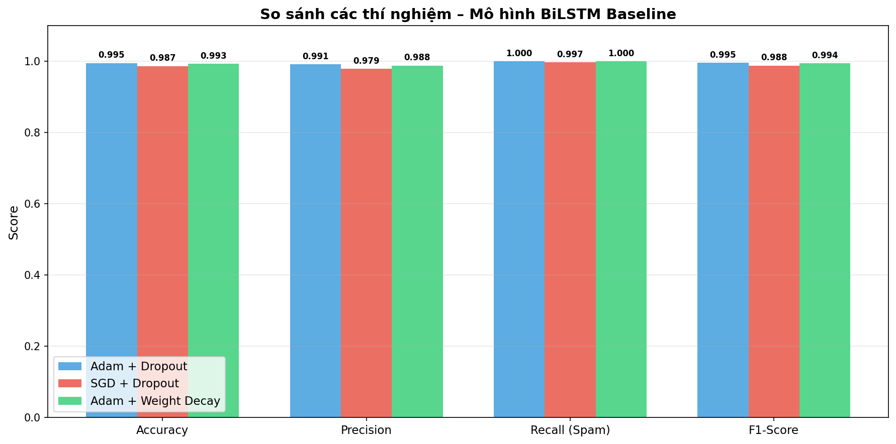

</details>

<details>
<summary>Phase 2 — Learning Curves</summary>

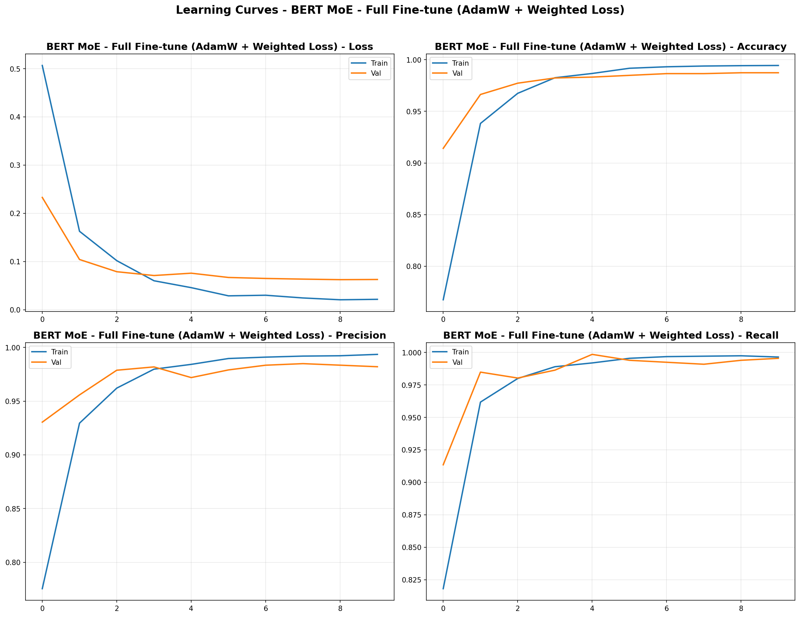
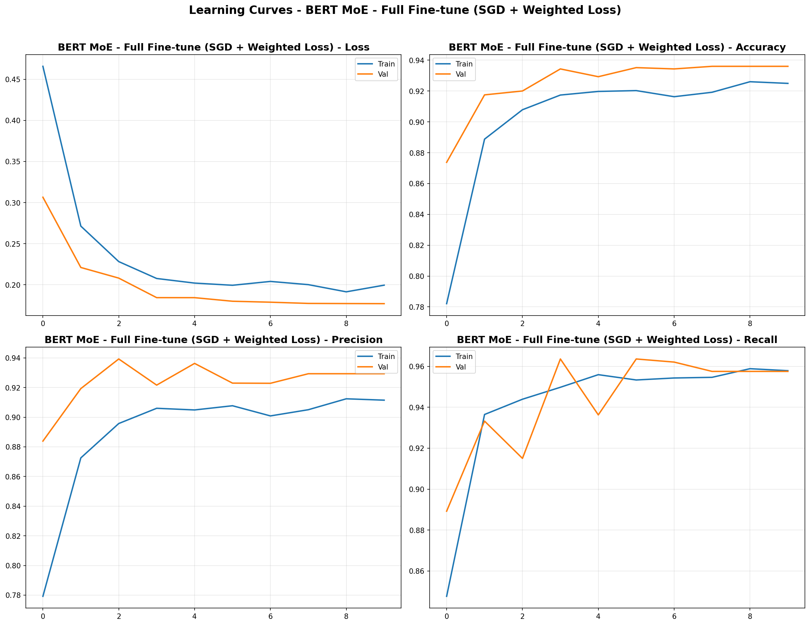
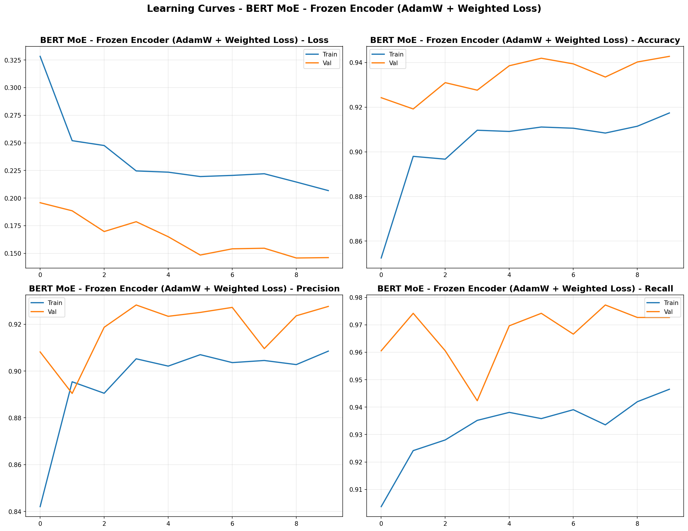

</details>

<details>
<summary>Phase 2 — Evaluation</summary>

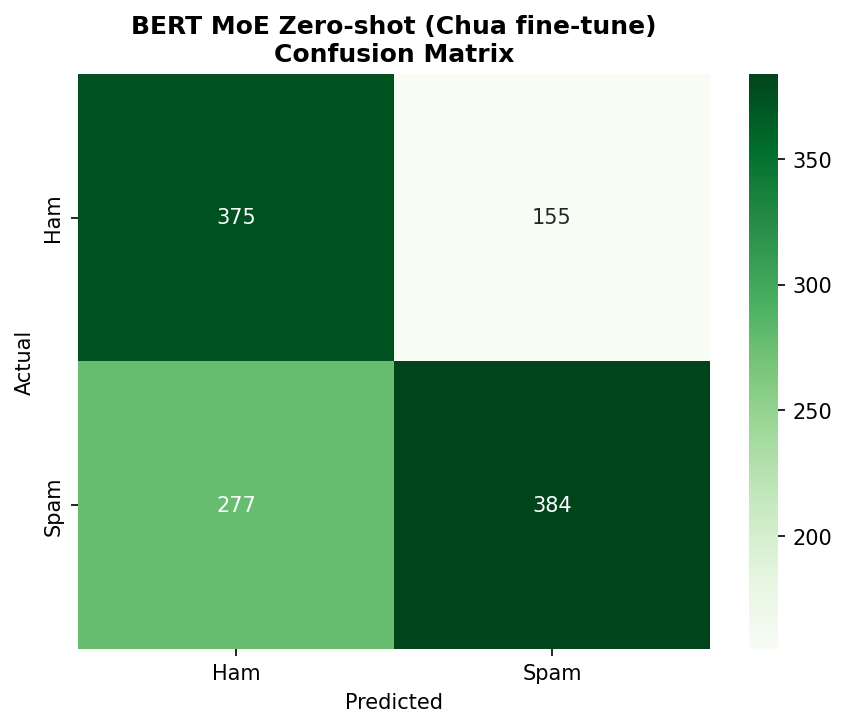
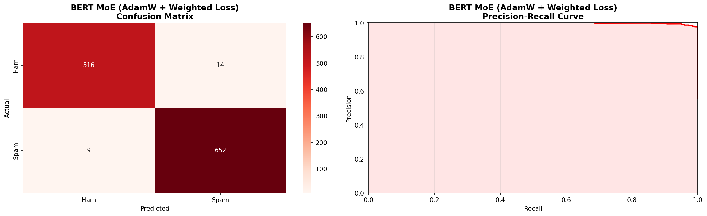


</details>

<details>
<summary>Final Comparison — All Models</summary>

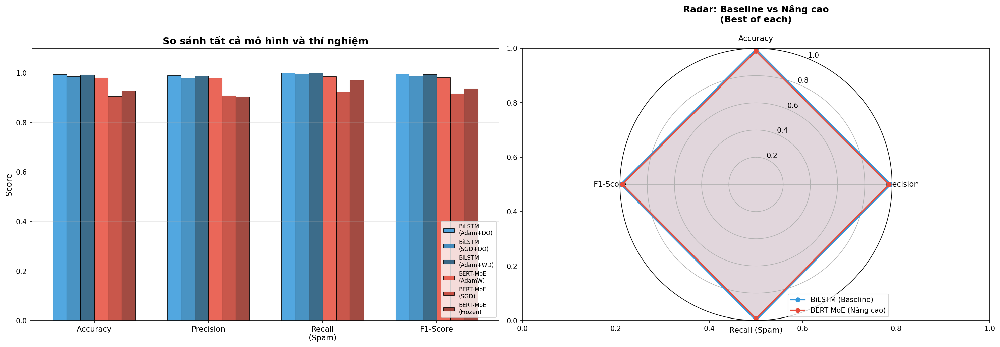
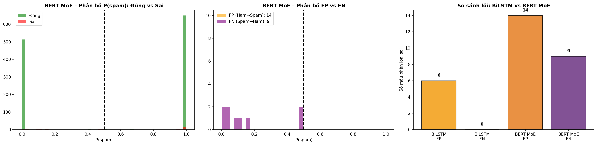

</details>

---

## Getting Started

### Requirements

| Dependency | Version |
|:-----------|:--------|
| Python | ≥ 3.10 |
| TensorFlow / Keras | ≥ 2.12 |
| PyTorch | ≥ 2.0 |
| Transformers (HuggingFace) | ≥ 4.35 |
| scikit-learn | ≥ 1.2 |
| pandas | ≥ 1.5 |
| numpy | ≥ 1.23 |
| matplotlib / seaborn | ≥ 3.6 / 0.12 |

### Option A — Google Colab (Recommended)

Both notebooks are designed to run on Google Colab with a GPU runtime.

1. Open the notebook for the phase you want to run:
   - **Phase 1 (Midterm):** `midterm_exam/BiLSTMandBiGRU+Attention.ipynb`
   - **Phase 2 (Final):** `final_exam/BiLSTMandBERT_MoE.ipynb`
2. In Colab: **Runtime → Change runtime type → GPU (T4)**
3. Mount your Google Drive when prompted and set the `DRIVE_PATH` variable to point to your dataset folder.
4. Run cells sequentially from top to bottom.

### Option B — Local Installation

```bash
git clone https://github.com/NhatTien1114/spam-email-detection.git
cd spam-email-detection

python -m venv venv
# Windows
venv\Scripts\activate
# macOS / Linux
source venv/bin/activate

pip install tensorflow torch transformers scikit-learn pandas numpy matplotlib seaborn
```

### Inference — Load a Saved Model

#### BiLSTM (TensorFlow / Keras)

```python
import pickle
from tensorflow import keras
from tensorflow.keras.preprocessing.sequence import pad_sequences

model = keras.models.load_model("email_spam_bertmoe/spam_model_bilstm.keras")

with open("email_spam_bertmoe/tokenizer_bilstm.pickle", "rb") as f:
    tokenizer = pickle.load(f)

def predict_bilstm(text, threshold=0.5):
    seq = tokenizer.texts_to_sequences([text])
    padded = pad_sequences(seq, maxlen=256, padding="post", truncating="post")
    prob = model.predict(padded, verbose=0)[0][0]
    label = "SPAM" if prob >= threshold else "HAM"
    print(f"{label}  |  confidence: {prob:.4f}")

predict_bilstm("Congratulations! You have won $1,000,000! Claim now!")
predict_bilstm("Hi, are you available for the team meeting tomorrow?")
```

#### BERT MoE (PyTorch + HuggingFace)

```python
import torch
from transformers import BertTokenizer, BertModel

# Load tokenizer and model weights
tokenizer = BertTokenizer.from_pretrained("email_spam_bertmoe/bert_moe_best")
# Instantiate your BertMoEClassifier class, then load state dict:
# model.load_state_dict(torch.load("email_spam_bertmoe/bert_moe_adamw.pt", map_location="cpu"))
# model.eval()

def predict_bert_moe(text, model, tokenizer, threshold=0.5):
    inputs = tokenizer(text, return_tensors="pt", truncation=True,
                       max_length=128, padding="max_length")
    with torch.no_grad():
        logits = model(**inputs)
    prob = torch.sigmoid(logits).item()
    label = "SPAM" if prob >= threshold else "HAM"
    print(f"{label}  |  confidence: {prob:.4f}")
```

> See the notebook `final_exam/BiLSTMandBERT_MoE.ipynb` for the full `BertMoEClassifier` class definition required to load the `.pt` checkpoints.

---

## Authors

| Name | Student ID |
|:-----|:-----------|
| Tống Nguyễn Nhật Tiến | 23684961 |
| Nguyễn Tiến Phát | 23689101 |

**Course:** Deep Learning · Ho Chi Minh City University of Technology and Education (HCMUTE)  
**Academic year:** 2025–2026

---

## References

1. I. Goodfellow, Y. Bengio, and A. Courville, *Deep Learning*, MIT Press, 2016.
2. S. Hochreiter and J. Schmidhuber, "Long Short-Term Memory," *Neural Computation*, vol. 9, no. 8, pp. 1735–1780, 1997.
3. K. Cho et al., "Learning Phrase Representations using RNN Encoder-Decoder for Statistical Machine Translation," *EMNLP*, 2014.
4. D. Bahdanau, K. Cho, and Y. Bengio, "Neural Machine Translation by Jointly Learning to Align and Translate," *ICLR*, 2015.
5. J. Devlin, M.-W. Chang, K. Lee, and K. Toutanova, "BERT: Pre-training of Deep Bidirectional Transformers for Language Understanding," *NAACL*, 2019.
6. N. Shazeer et al., "Outrageously Large Neural Networks: The Sparsely-Gated Mixture-of-Experts Layer," *ICLR*, 2017.
7. D. P. Kingma and J. Ba, "Adam: A Method for Stochastic Optimization," *ICLR*, 2015.
8. N. Srivastava et al., "Dropout: A Simple Way to Prevent Neural Networks from Overfitting," *JMLR*, vol. 15, 2014.
9. I. Loshchilov and F. Hutter, "Decoupled Weight Decay Regularization," *ICLR*, 2019.

---

<div align="center">

*Made for the Deep Learning course at HCMUTE · 2025–2026*

</div>
